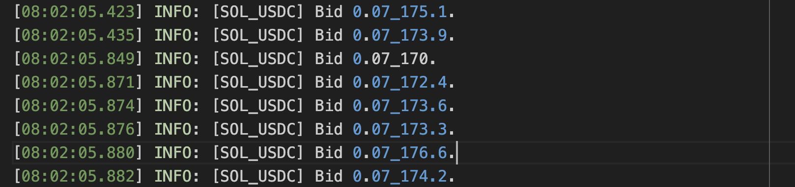
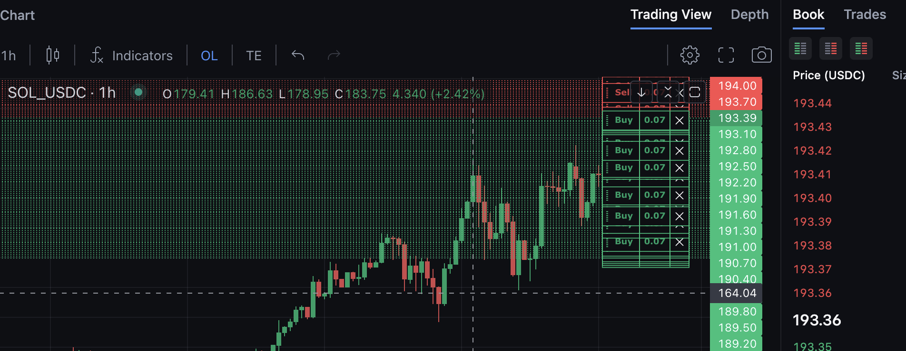

# Backpack Grid Trading Bot

A Grid Trading Bot For Backpack Exchange.

## Setup

In order to run the script you need to:

* Install nodejs.
* Create an API Key for backpack exchange.
* Have enough funds for trading pair.
* Create a telegram bot for trading notification (*Optional*).
* Configure the script by updating .env.copy  file (remove the .copy from the file name when done).
    * `BACKPACK_API_KEY` your backpack exchange api key
    * `BACKPACK_API_SECRET` your backpack exchange api secret
    * `SYMBOL` your trading pair, like `SOL_USDC`, make sure you have enough SOL and enough USDC.
    * `LOWER_PRICE` the bottom price of grid, like `170`
    * `UPPER_PRICE` the top price of grid, like `200`
    * `NUMBER_OF_GRIDS` the number of grids, like `100`
    * `QUANTITY_PER_GRID`= the quantity of each grid like `0.07`
    * `TELEGRAM_BOT_API_TOKEN` telegram bot token
    * `TELEGRAM_TARGET_CHAT_ID` chat id


Something need to do.

```shell
npm install -g pm2
npm install -g typescript
```

then use ```yarn start``` to run, you can see a log file named gridbot.log





## Something coming soon

1. calculate grid initial cost, and check user fund.

## Sponsor

If this bot has been helpful to you, I'd appreciate it if you could buy me a cup of coffee.

SOL Address: 5WWBB4Ct8gCczZDYCx587Qj3KoteZXisAkWVMMxh2Fgn